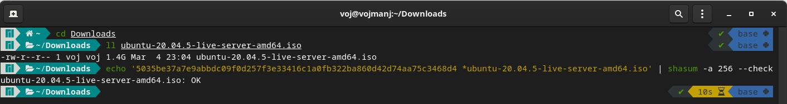
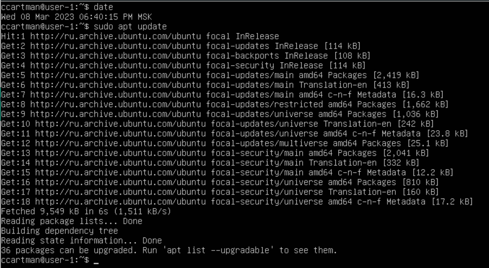
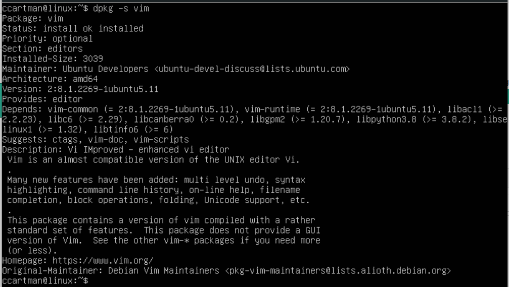
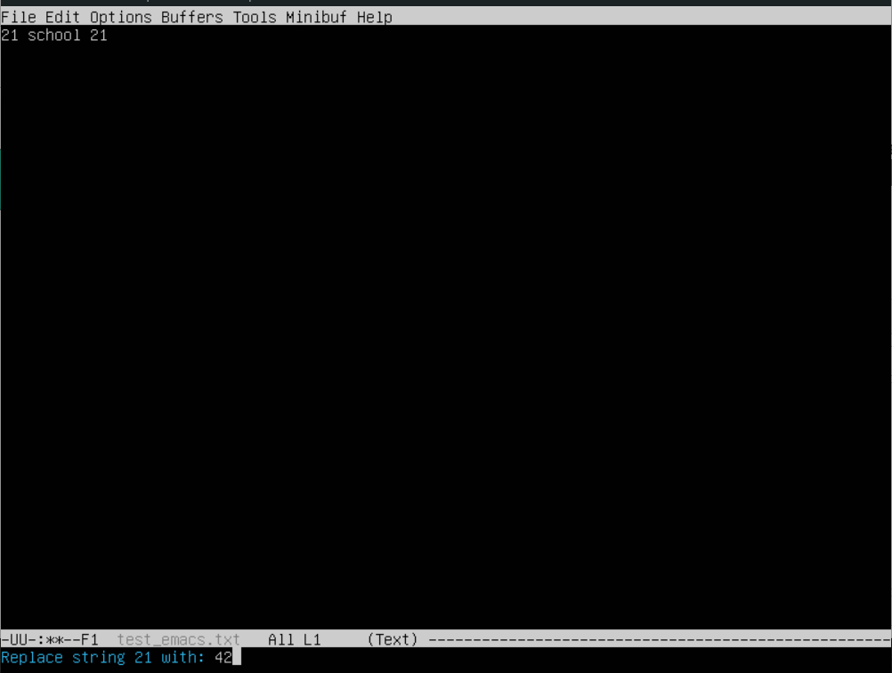
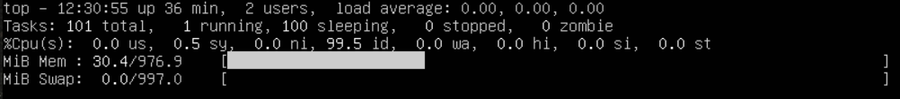
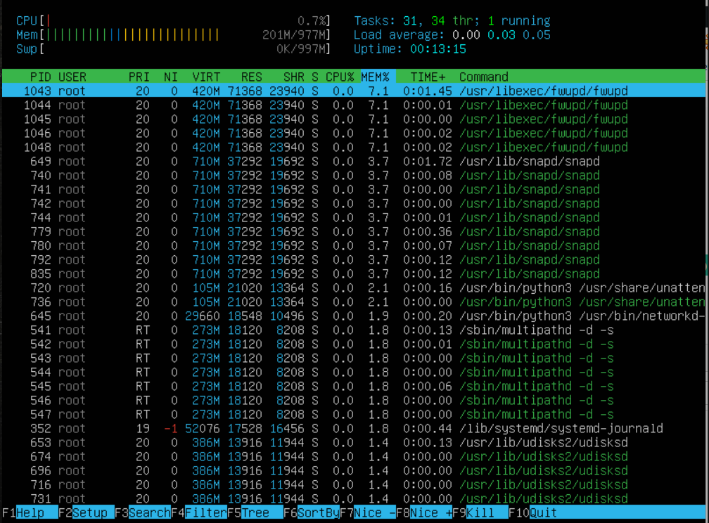
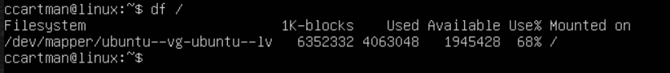

# UNIX/Linux operating systems (Basic).

## Contents

1. [Installation of the OS](#part-1-installation-of-the-os)
2. [Creating a user](#part-2-creating-a-user)
3. [Setting up of the OS network](#part-3-setting-up-of-the-os-network)
4. [OS Update](#part-4-os-update)
5. [Using the sudo command](#part-5-using-the-sudo-command)
6. [Installing and configuring the time service](#part-6-installing-and-configuring-the-time-service)
7. [Installing and using text editors](#part-7-installing-and-using-text-editors)
8. [Installing and basic setup of the SSHD service](#part-8-installing-and-basic-setup-of-the-sshd-service)
9. [Installing and using the top, htop utilities](#part-9-installing-and-using-the-top-htop-utilities)
10. [Using the fdisk utility](#part-10-using-the-fdisk-utility)
11. [Using the df utility](#part-11-using-the-df-utility)
12. [Using the du utility](#part-12-using-the-du-utility)
13. [Installing and using the ncdu utility](#part-13-installing-and-using-the-ncdu-utility)
14. [Working with system logs](#part-14-working-with-system-logs)
15. [Using the CRON job scheduler](#part-15-using-the-cron-job-scheduler)

## Part 1. Installation of the OS

#### Установить Ubuntu 20.04 Server LTS без графического интерфейса. (Используем программу для виртуализации - VirtualBox)

- Загрузка образа операционной системы ubuntu-20.04 LTS и проверка чек-суммы. \
  
- Конфигурация новой виртуальной машины в Oracle VM VirtualBox:
  - Создание новой виртуальной машины в Oracle VM VirtualBox \
    
  - Настройка аппаратного обеспечения виртуальной машины \
    
  - Создание виртуального жесткого диска \
    
  - Итоговые настройки виртуальной машины \
    
- Установка операционной системы на виртуальную машину:
  - Выбор языка \
    
  - Выбор расскладки клавиатуры \
    
  - Настройка сетевого интерфейса (по умолчанию) \
    
  - Настройка прокси (по умолчанию) \
    
  - Выбор зеркала архива Ubuntu (по умолчанию) \
    
  - Разбиение жесткого диска (по умолчанию) \
    
  - Результат разиения жесткого диска \
    
  - Настройки профиля (имя пользователя, название машины, задание пароля) \
    
  - Установка ssh (по умолчнию нет) \
    
  - Установка дополнительных snap пакетов (по умолчанию нет) \
    
  - Установка завершена \
    
- Версия установенной операционной системы \
   \
  `/etc/issue` это текстовый файл, в котором содержится сообщение о индитификаторе системы.

[VirtualBox User Manual](https://www.virtualbox.org/manual/UserManual.html) \
[Basic installation tutorial](https://ubuntu.com/server/docs/installation) \
[/etc/issue man-page](https://manpages.ubuntu.com/manpages/focal/en/man5/issue.5.html)

## Part 2. Creating a user

#### Cоздать нового пользователя и добавить его в группу adm.

- Cоздать нового пользователя: \
  
  - Утилита `useradd` позволяет создать нового пользователя. \
    Опция `-G` позволяет добавить пользователя в определенные группы. \
    Oпция `-s` - назначить командную оболочку по умолчанию.\
    Опция `-с` - добавить информацию о пользователе. \
    Опция `-d` - назначить домашнюю директорию.
  - С помощью утилиты `passwd` назначаем пароль для нового пользователя.
  - C помощью утилиты `mkdir` создаем домашнюю директорию для нового пользователя.
  - C помощью утилиты `chown` меняем владельца домашней директории на нового пользователя.
  - C помощью утилиты `su` меняем пользователя. Переходим в домашний каталог. \
    Используя утилиту `groups`, отображаем группы, в которых состоит новый пользователь. \
    Члены группы adm имеют права для чтения журналов. Пробуем прочитать файл `/var/log/syslog`.
- Файл `/etc/passwd` содержит информацию о всех пользовательских аккаунтах.
  
- Строка, содержащая информацию о новом пользователе. \
  

[Ubuntu user management](https://ubuntu.com/server/docs/security-users) \
[useradd man-page](https://manpages.ubuntu.com/manpages/focal/en/man8/useradd.8.html) \
[passwd man-page](https://manpages.ubuntu.com/manpages/focal/en/man1/passwd.1.html) \
[mkdir man-page](https://manpages.ubuntu.com/manpages/focal/en/man1/mkdir.1.html) \
[chown man-page](https://manpages.ubuntu.com/manpages/focal/en/man1/chown.1.html) \
[su man-page](https://manpages.ubuntu.com/manpages/focal/en/man1/su.1.html) \
[groups man-page](https://manpages.ubuntu.com/manpages/focal/en/man1/groups.1.html) \
[/etc/passwd man-page](https://manpages.ubuntu.com/manpages/focal/en/man5/passwd.5.html)

## Part 3. Setting up of the OS network

#### Задать имя машины.

- Имя хоста содержится в файле /etc/hostname \
  Чтобы изменить его, можно возмользоваться утилитой `hostnamectl set-hostname`: \
   \
  Также изменим имя хоста в файле `/etc/hosts`: \
  

#### Установить временную зону.
- Для настройки системных часов, используем утилиту `timedatectl`. \
  Чтобы узнать текущие настройки, используем команду `timedatectl status`. \
  Список доступных временных зон, получаем с помощью команды `timedatectl list-timezones`. \
  Чтобы изменить временную зону, используем команду `timedatectl set-timezone`. \
  

#### Вывести список сетевых интерфейсов.

- Чтобы определить все доступные сетевые интерфейсы, можно использовать команду `ip link list`. \
  Всего есть два сетевых интерфейса, первый - виртуальный, второй - ethernet. \
  lo (loopback device) – виртуальный интерфейс, присутствующий по умолчанию в любом Linux. \
  Он используется для отладки сетевых программ и запуска серверных приложений на локальной машине. \
  С этим интерфейсом всегда связан адрес 127.0.0.1. У него есть dns-имя – localhost. \
  Посмотреть привязку можно в файле `/etc/hosts`. \
  

#### Получить ip адрес устройства от DHCP сервера.

- DHCP (англ. Dynamic Host Configuration Protocol — протокол динамической настройки узла) — \
  сетевой протокол, позволяющий сетевым устройствам автоматически получать IP-адрес и \
  другие параметры, необходимые для работы в сети TCP/IP.
- Данный протокол работает по модели «клиент-сервер». Для автоматической конфигурации \
  компьютер-клиент на этапе конфигурации сетевого устройства обращается к так называемому серверу \
  DHCP и получает от него нужные параметры. Протокол DHCP используется в большинстве сетей TCP/IP.
- Чтобы узнать ip адрес сетевого интерфейса, можно воспользоваться командой `ip address show`.
- Чтобы сбросить ip адрес на сетевом интерфейсе, используем команду `dhclient -r`.
- И для того, чтобы получить ip адрес для сетевого интерфейса, используем команду `dhclient -v`. \
  

#### Определить внешний и внутренний ip-адреса шлюза.

- Чтобы узнать внешний ip адрес, можно запросить от внешнего сервера ip адрес, \
  с которого к нему пришел запрос, например ipecho.
- Чтобы знать внутрений ip адрес шлюза, можно воспользоваться командой `ip route list`. \
  Он выведется в строке, начинающейся с default via (путь по умолчанию). \
  

#### Задать статичные настройки ip, gw, dns.

- Чтобы задать статичные ip, gw, dns адреса нужно описать конфигурационный файл для `netplan` в директории `/etc/netplan/` с расширением `yaml`: \
  
  - Имя сетевого интерфейса enp0s3.
  - Отклоняем настройки от dhcp сервера.
  - Адрес для шлюза оставляем, как и был.
  - Присваиваем сетевому интерфейсу адрес в этой же подсети, что и для шлюза.
  - Добавляем адреса для dns серверов.
- Удаляем конфигурационный файл, созданный системой.
- Нужно применить настройки командой `netplan apply`.
- Проверяем адреса интефейса и шлюза. Они соответствуют заданным в конфигурационном файле. \
  

#### Перезагрузить виртуальную машину. Убедиться, что статичные сетевые настройки сохранились.

- Перезагружаем систему.
- Проверяем адреса интефейса и шлюза. \
  Они соответствуют заданным в конфигурационном файле `/etc/netplan/config.yaml`.
- С помощью утилиты `ping` пробуем отправить пакеты на 1.1.1.1 и ya.ru. Потерь нет. \
  

[/etc/hosts man-page](https://manpages.ubuntu.com/manpages/focal/en/man5/hosts.5.html) \
[/etc/hostname man-page](https://manpages.ubuntu.com/manpages/focal/en/man5/hostname.5.html) \
[hostname man-page](https://manpages.ubuntu.com/manpages/focal/en/man1/hostname.1.html) \
[hostnamectl man-page](https://manpages.ubuntu.com/manpages/focal/en/man1/hostnamectl.1.html) \
[timedatectl man-page](https://manpages.ubuntu.com/manpages/focal/en/man1/timedatectl.1.html) \
[ip man-page](https://manpages.ubuntu.com/manpages/focal/en/man8/ip.8.html) \
[dhclient man-page](https://manpages.ubuntu.com/manpages/focal/en/man8/dhclient.8.html) \
[curl man-page](https://manpages.ubuntu.com/manpages/focal/en/man1/curl.1.html) \
[ubuntu network introduction](https://ubuntu.com/server/docs/network-introduction) \
[netplan web site](https://netplan.io/) \
[netplan documentation](https://netplan.readthedocs.io/en/stable/) \
[netplan man-page](https://manpages.ubuntu.com/manpages/focal/man5/netplan.5.html) \
[netplan ip server man-page](https://manpages.ubuntu.com/manpages/focal/en/man8/netplan.8.html) \
[ping man-page](https://manpages.ubuntu.com/manpages/focal/en/man1/ping.1.html) \
[uptime man-page](https://manpages.ubuntu.com/manpages/focal/en/man1/uptime.1.html)

## Part 4. OS Update

#### Обновить системные пакеты до последней версии.

- Обновить индекс пакетов. \
  Индекс пакетов APT - это, по сути, база данных доступных пакетов из репозиториев, \
  определенных в файле `/etc/apt/sources.list` и в каталоге `/etc/apt/sources.list.d`. \
  Чтобы обновить индекс локальных пакетов с учетом последних изменений, внесенных в репозитории, \
  используем команду `$>sudo apt update`: \
  
- Обновить пакеты. \
  Установленные на компьютере пакеты могут периодически обновляться из репозиториев пакетов \
  (например, обновления для системы безопасности). \
  Чтобы обновить нашу систему, сначала обновим индекс локальных пакетов с помощью `sudo apt update`, \
  а затем сами пакеты с помощью команды `$>sudo apt upgrade`: \
  
- `$>sudo apt upgrade` - в последней строке сообщается, что обновлений нет: \
  

[ubuntu package management](https://ubuntu.com/server/docs/package-management) \
[apt man-page](https://manpages.ubuntu.com/manpages/focal/en/man8/apt.8.html)

## Part 5. Using the sudo command

#### Разрешить новому пользователю выполнять команду sudo.

*sudo (substitute user and do, дословно «подменить пользователя и выполнить») — программа для системного администрирования UNIX-систем, позволяющая делегировать те или иные привилегированные ресурсы пользователям с ведением протокола работы.*
*Программа sudo настраивается через файл /etc/sudoers.*
*В Debian-based-дистрибутивах пользователь root не имеет пароля, вместо этого все административные действия должны производиться через sudo.*

- Перключаемся на нового пользователя и пробуем изменить имя хоста. Ошибка.
- Возвращаемся к старому пользователю и добавляем нового в группу sudo с помощью команды `usermod`, \
  опция `-a` добавляет изменения к существующим настройкам,
  опция `-G` позволяет добавить пользователя в существующую группу.
- Пробуем снова изменить имя машины от лица нового пользователя. Теперь все получилось.
- Существует файл `/etc/sudoers`, в котором можно задать огромное количество настроек для \
  команды `sudo`. Этот файл редактируется с помощью утилиты `visudo`, которая проверяет \
  корректность синтаксиса конфирурационного файла `/etc/sudoers`.
  

[usermod man-page](https://manpages.ubuntu.com/manpages/focal/en/man8/usermod.8.html) \
[sudo man-page](https://manpages.ubuntu.com/manpages/focal/en/man8/sudo.8.html) \
[/etc/sudoers man-page](https://manpages.ubuntu.com/manpages/focal/en/man5/sudoers.5.html) \
[visudo man-page](https://manpages.ubuntu.com/manpages/focal/en/man8/visudo.8.html)

## Part 6. Installing and configuring the time service 

#### Настроить службу автоматической синхронизации времени.

*Network Time Protocol (NTP) - это сетевой протокол для синхронизации времени по сети. По сути, клиент запрашивает текущее время у сервера и использует его для установки своих собственных часов.*

*По умолчанию Ubuntu использует timedatectl/timesyncd для синхронизации времени, и пользователи могут дополнительно использовать chrony для обслуживания протокола сетевого времени.*

- Вывести время, часового пояса, в котором вы сейчас находитесь. \
  Команда `$>date` выводит время установленного часового пояса:
  
- Текущее состояние времени и настройки времени  timedatectl и timesyncd \
  можно проверить с помощью команд `timedatectl status` и `timedatectl timesync-status`: \
  

- Настройка chrony для синхронизации времени:
  - Cначала отключим синхронизацию времени командой `timedatectl set-ntp false`. \
    
  - Установим сервис chrony командой `$>sudo apt install chrony`. \
    Пакет `systemd-timesync` будет удален. \
   `chronyd` - фактический демон для синхронизации с сервером по протоколу сетевого времени. \
   `chronyc` - интерфейс командной строки для демона chrony: \
    
  - Для конфигурирования службы chrony есть конфигурационный файл `/etc/chrony/chrony.conf`: \
    
  - Перазапустим сервис chrony. И проверим статус timedatectl: \
    

*Вы можете установить chrony и настроить специальное оборудование для локальной синхронизации. Но если вы хотите предоставлять NTP сервис, вам нужно адаптировать свою конфигурацию.*

*Чтобы включить обслуживание NTP, вам нужно, по крайней мере, установить правило allow. Это определяет, каким клиентам/сетям вы хотите, чтобы chrony обслуживал NTP.*

*Примером может быть: allow 10.0.2.0*

[date man-page](https://manpages.ubuntu.com/manpages/focal/en/man1/date.1.html) \
[ubuntu time synchronization](https://ubuntu.com/server/docs/network-ntp) \
[timedatectl man-page](https://manpages.ubuntu.com/manpages/focal/en/man1/timedatectl.1.html) \
[timesyncd.conf man-page](https://manpages.ubuntu.com/manpages/focal/en/man5/timesyncd.conf.5.html) \
[chronyd man-page](https://manpages.ubuntu.com/manpages/focal/en/man8/chronyd.8.html) \
[chronyc man-page](https://manpages.ubuntu.com/manpages/focal/en/man1/chronyc.1.html) \
[chrony.conf man-page](https://manpages.ubuntu.com/manpages/focal/en/man5/chrony.conf.5.html)

## Part 7. Installing and using text editors

#### Установить текстовые редакторы.

- Редактор vim установлен в системе по умолчанию: \
  
- Редактор nano установлен в системе по умолчанию: \
  
- Редактор emacs установим командой `$>sudo apt install emacs`: \
  

#### Создать и сохранить с измениями файлы с помощью редакторов.

- Редактор vim. \
  `$>vim test_vim.txt`:\
  Команда `i` - режим редактирования \
  `ESC` выход из режима редактирования в режим команд \
  `:wq` - выход из редактора с сохранением изменений \
  
- Редактор nano. \
  `$>nano test_nano.txt`: \
  `Ctrl^X` для выхода из редактора. Для сохранения изменений нажимаем - `y`: \
  
- Редактор emacs. \
  `$>emacs test_emacs.txt`: \
  `Ctrl^X Ctrl^C` для выхода из редактора. Для сохранения изменений нажимаем - `y`: \
  

#### Открыть файл на редактирование, редактировать и выйти без сохранения изменений.

- Редактор vim. \
  `$>vim test_vim.txt`: \
  Команда `dd` - удалить строчку \
  Команда `i` - режим редактирования \
  `ESC` выход из режима редактирования в режим команд \
  `:q!` - выход из редактора без сохранения изменений: \
  
- Редактор nano.
  `$>nano test_nano.txt`: \
  `Ctrl^X` для выхода из редактора. Для отказа от сохранения изменений нажимаем - `n`:
  
- Редактор emacs. \
  `$>emacs test_emacs.txt`: \
  `Ctrl^X Ctrl^C` для выхода из редактора. Далее `q` и `yes` \
  

#### Реактирование, поиск и замена по содержимому файла.

- Редактор vim. \
  `$>vim test_vim.txt`: \
  `ESC` - режим команд и `/school` для поиска по содержимому. \
  Для перемещения по списку найденных совпадений использовать `n` и `N` в режиме команд: \
   \
  `ESC` и `:%s/21/42/g` - глобальная замена 21 на 42: \
  
- Редактор nano. \
  `$>nano test_nano.txt`: \
  `Ctrl^W` для поиска по содержимому. Далее просто вводим искомое содержимое и нажимаем `Enter` \
  Для перемещения по списку найденных совпадений `Cntl-W` и `enter` \
   \
  `Ctrl^\` для замены содержимомого. \
  Далее вводим искомое, например 21, `enter`, вводим на что заменить, например 42, `enter` \
  и выбираем какое вхождение заменить, например все - A \
  
- Редактор emacs. \
  `$>emacs test_emacs.txt`: \
  `Ctrl^S` для поиска содержимого \
   \
  Для замены содержимого ввести `M-X (alt^X) replace-string` \
  Затем `enter`, затем что меняем, например 21, `enter`, затем на что меняем, например 42, `enter` \
  

[vim man-page](https://manpages.ubuntu.com/manpages/focal/en/man1/vim.1.html) \
[nano man-page](https://manpages.ubuntu.com/manpages/focal/en/man1/nano.1.html) \
[emacs manual](https://www.gnu.org/software/emacs/manual/html_node/emacs/index.html)

## Part 8. Installing and basic setup of the SSHD service

*OpenSSH - это мощный набор инструментов для удаленного управления сетевыми компьютерами и передачи данных между ними.*
*OpenSSH предоставляет серверный демон и клиентские инструменты для облегчения безопасного, зашифрованного удаленного управления и операций передачи файлов, эффективно заменяя устаревшие инструменты.*
*Серверный компонент OpenSSH, sshd, непрерывно прослушивает клиентские подключения из любого из клиентских инструментов. Когда возникает запрос на подключение, sshd устанавливает правильное подключение в зависимости от типа подключаемого клиентского инструмента.*

#### Установить службу SSHd.

 - Установка SSH клиета: `$>sudo apt install openssh-client`
 - Установка SSH сервера: `$>sudo apt install openssh-server`

#### Добавить автостарт службы при загрузке системы.

- Чтобы сервис стартовал при загрузке, используем команду `systemctl enable ssh.service`:
  

#### Перенастроить службу SSHd на порт 2022.

- Можно настроить поведение серверного приложения OpenSSH sshd, отредактировав файл `/etc/ssh/sshd_config`. \
  `$>sudo vim /etc/ssh/sshd_config`:
  - Устанавливаем порт, на которой будет работать служба \
    
  - Разрешаем подключение по публичному ключу и по паролю \
    
  - Перезапускаем ssh сервис \
    

#### Используя команду ps, показать наличие процесса sshd.

- Утилита `ps` отображает информацию о активных процессах:
  - `$>ps -F -C sshd` \
    Опция `-F` отображает больше информмационных полей \
    Опция `-C` позволяет выбрать процесс по имени команды \
    
   - `$> ps axfv` \
     Опции `ax` используются для перечисления всех процессов \
     Опции `f` выдает больше информации о процессе \
     Опции `v` отображает в выводе информацию о виртуальной памяти \
      \
     

#### Перезагрузить систему.

- `$>reboot`
- Установим утилиту пакет net-tools \
  `$>sudo apt update && apt install net-tools` \
  Теперь в системе появилась утилита netstat.
- *Netstat - отображает информацию о сетевых подключениях, таблицах маршрутизации, статистики интерфейсов и пр.*
- *IP-адрес 0.0.0.0 — это немаршрутизируемый адрес IPv4, который можно использовать в разных целях, в основном, в качестве адреса по умолчанию или адреса-заполнителя.\
  Несмотря на то, что адрес 0.0.0.0 может использоваться в компьютерных сетях, он не является адресом какого-либо устройства.* \
  *Инженерная группа постановки задач Интернета IETF определяет IP-адрес 0.0.0.0 как «зарезервированный адрес специального назначения».*
- `$>netstat -tan`: \
  
- Опция `-t` отображает информацию о tcp подключениях. \
  Опция `-a` отображает информацию о всех соккетах, в состоянии прослушиния и нет. \
  Опция `-n` отображает адреса в виде чисел, а не подставляет вместо адресов имена.
  1. Первый столбец - `Proto` - информирует о типе протокола используемом на соккете.
  2. Второй столбец - `Recv-Q` - для состаяния установленного соедининения: количество байтов, \
     не скопированных пользовательской программой, подключенной к этому сокету; \
     для состояния прослушивания: столбец содержит текущее отставание.
  3. Третий столбец - `Send-Q` - для состояния установленного соединения: \
     количество байтов, не подтвержденных удаленным хостом; \
     для состояния прослушивание: содержит максимальный размер невыполненной работы.
  4. Четвертый столбец - `Local Address` - адрес и номер порта локального конца соккета. \
     Адрес 0.0.0.0 в данном случае означает все адреса на локальном компьютере.
  5. Пятый столбец - `Foreign Address` - адрес и номер порта удаленного конца сокета. \
     Адрес 0.0.0.0 в даном случае обознает всю мировую сеть.
  6. Шестой столбец - `State` - текущее состояние сокета.

#### Подключиться к ssh серверу.

- *Сначала настроим проброс портов в VirtualBox*.
  - Настройки вирутальной машины. Network: \
    
  - Port Forwarding. Нужно добавить новое правило: \
    
- В терминале хостовой машины подключаемся с помощью ssh клиента через порт 2022 к гостевой машине: \
  
- Netstat на гостевой машине показывает, что соединение установлено: \
  

[ubuntu openSSH server](https://ubuntu.com/server/docs/service-openssh) \
[openssh daemon man-page](https://manpages.ubuntu.com/manpages/focal/en/man8/sshd.8.html) \
[openssh client man-page](https://manpages.ubuntu.com/manpages/focal/en/man1/ssh.1.html) \
[ssh_config man](https://manpages.ubuntu.com/manpages/focal/en/man5/ssh_config.5.html) \
[ps man-page](https://manpages.ubuntu.com/manpages/focal/en/man1/ps.1.html) \
[netstat man-page](https://manpages.ubuntu.com/manpages/focal/en/man8/netstat.8.html)

## Part 9. Installing and using the top, htop utilities

#### Установить и запустить утилиты top и htop.

- Утилита **top** установлена по умолчанию. Запустить командой `$>top` \
  
- В верхней части экрана (summary display) отображается общая информация о системе:
  - Первая строка содержит информацию о:
    - **uptime**: 21 минута - время с последней загрузки системы.
    - **users**: 2 - количество авторизированных пользоватей.
    - **load average**: 0.00, 0.00, 0.01 - общая загруженность систему за последние 1, 5 и 15 минут
  - Вторая строка содержит информацию о:
    - **tasks**: 99, 1, 98, 0, 0 - общее количество запущеннных в системе процессов (всего, активных, спящих, остановленных, зомби)
  - Третья строка содежит информацию о:
	- **%CPU**: 0.0, 0.7, 0.0, 99.3, 0.0, 0.0, 0.0, 0.0 - загруженность центрального процессора, выраженная в процентах от общего времени (время исполнения пользовательских процессов, время исполнения процессов ядра, время исполнения пользовательских привилигированных процессов, время выполнения оброботчиков ядра, время ожидания I/O, время на обработку аппаратных прерываний, время на обработку программных прерываний, время, украденное от этой вм гипервизиром).
  - Четвертая строка содежит информацию о:
    - **MEM**: 976.9, 404.1, 159.7, 413.0 - использование оперативной памяти в МiB (всего, свободно, использовано, буфферизировано/закешированно). 
  - Пятая строка содежит информацию о:
    - SWAP: 997.0, 997.0, 0.0, 675.6 - использование виртуальной памяти в MiB (всего, свободно, использовано, доступно, т.е. доступное количество оперативной памяти для запуска новго процесса без использования виртуальной).
  - `m` -- команда выключения или переключения режима отображения информации о памяти
    - можно добиться такого вывода: \
      
    - или такого: \
      
  - **PID процесса занимающего больше всего памяти** - 650.
    - Чтобы узнать это, нужно отсортировать окно процессов по колонке MEM, используя команду `SHIFT^M`: \
      
  - **PID процесса занимающего больше всего времени центрального процессора** - 1200.
    - Чтобы узнать это, нужно отсортировать окно процессов по колонке CPU, используя команду `SHIFT^P`: \
      
- Утилита **htop** установлена по умолчанию. Запустить командой `$>htop` \
  
  - Чтобы отсортировать вывод утилиты **htop**, нужно нажать клавишу `F6` и выбрать из списка параметр (при этом цветом выделяется поле, соответствующее параметру):
    - Вывод, отсортированный по параметру **PID**: \
      
    - Вывод, отсортированный по парраметру **PERCENT_CPU**: \
      
    - Вывод, отсортированный по параметру **PERCENT_MEM**: \
      
    - Вывод, отсортированный по параметру **TIME**: \
      
  - Чтобы отфильтровать вывод утилиты **htop**, нужно нажать клавишу `F4` и ввести имя, по которому нужно фильтровать:
    - Вывод, отфильтрованный для процесса **SSHD**: \
      
  - Чтобы воспользоваться поиском нужно нажать клавишу `F3` и ввести искомое имя:
    - Вывод для найденого процесса **syslog**: \
      
  - Чтобы добавить информации в вывод, нужно нажать `F2` и выбрать в первой колонке поле **meters**, за тем из крайней правой колоники (available meters) выбрать метрики и с помощью клавиш-стрелок перместить в нужное положение левой или правой колонки:
    - Вывод с добавленными метриками **hostname**, **clock** и **uptime**: \
      
   
[top man-page](https://manpages.ubuntu.com/manpages/focal/en/man1/top.1.html) \
[htop man-page](https://manpages.ubuntu.com/manpages/focal/en/man1/htop.1.html)

## Part 10. Using the fdisk utility

#### Запустить утилиту fdisk.

- `$>sudo fdislk -l` (опция -l выводит список всех определенных устройств): \
  
- в системе определился только один жесткий диск /dev/sda. \
  команда `$>sudo fdisk -l /dev/sda` выведет информацию об этом устройстве: \
  
  - **название:** sda
  - **размер:** 8 GiB
  - **количество секторов:** 16777216
- при установке на этапе разметки диска раздел swap не монтировался отдельно. \
  Поэтому с помощью утилиты fdisk не получится узнать его размер. \
  Mожно воспользоваться командой `$>swapon --show`: \
  
  - **размер swap:** 997 MiB

[fdisk man-page](https://manpages.ubuntu.com/manpages/focal/en/man8/fdisk.8.html) \
[swapon man-page](https://manpages.ubuntu.com/manpages/focal/en/man8/swapon.8.html)

## Part 11. Using the df utility

#### Запустить утилиту df.

- `$>df`: \
  
- `$>df /`: \
   \
  - **размер раздела:** 6352332
  - **размер занятого пространства:** 4063048
  - **размер свободного пространства:** 1945428
  - **процент использования:** 68
- Единица измерения по умолчанию это количество кибибайтных (1024 байта) блоков. \
  

#### Запустить утилиту df с опциями T и h.

- `$>df -Th`: \
   \
  - опция T добавляет к выводу тип файловой системы.
  - опция h форматирует вывод размеров в степенях по основанию 1024.
- `$>df -Th /`: \
   \
  - **размер раздела:** 1.6 GiB
  - **размер занятого пространства:** 3.9 GiB
  - **размер свободного пространства:** 1.9 GiB
  - **процент использования:** 68
 - **Tип файловой системы** ext4 -  журналируемая файловая система, \
   используемая преимущественно в операционных системах с ядром Linux.

[df man-page](https://manpages.ubuntu.com/manpages/focal/en/man1/df.1.html)

## Part 12. Using the du utility

**du** - это команда для получения приблизительного объема дискового пространства, используемого указанными при вызове команды файлами или каталогами.
По умолчанию размер выводится в kибибайтах. Для того чтобы размер выводился в более читабельном виде используйте опцию -h. Опция --block-size позволяет задавать размер выводимых блоков. Опция -и эквивалентна --block-size=1. Опция -s выводит только итоговый размер для каждого аргумента.

#### Запустить команду du.

- `$>du`: \
  

#### Вывести размер дирректорий /home, /var, /var/log (в байтах, в человекочитаемом виде).

- **/home:**
  - `$>du -b -s /home`:
  - `$>du -h -s /home`: \
    
- **/var:**
  - `$>sudo du -b -s /var`:
  - `$>sudo du -h -s /var`: \
    
- **/var/log:**
  - `$>sudo du -b -s /var/log`:
  - `$>sudo du -h -s /var/log`: \
    

#### Вывести размер всего содержимого в /var/log (не общее, а каждого вложенного элемента, используя *)

- **/var/log/**\*:
  - `$>sudo du /var/log/*`: \
    

[du man-page](https://manpages.ubuntu.com/manpages/focal/en/man1/du.1.html)

## Part 13. Installing and using the ncdu utility

ncdu - это команда, имеющая то же назначение, что и du, но обладающая приятным и удобным интерфейсом.

#### Установить утилиту ncdu.

- `$>sudo apt install ncdu`: \
  

#### Вывести размер папок /home, /var, /var/log.

- `$>ncdu /home`: \
  
- `$>sudo ncdu /var`: \
  
- `$>sudo ncdu /var/log`: \
  

[ncdu man-page](https://manpages.ubuntu.com/manpages/focal/en/man1/ncdu.1.html)
